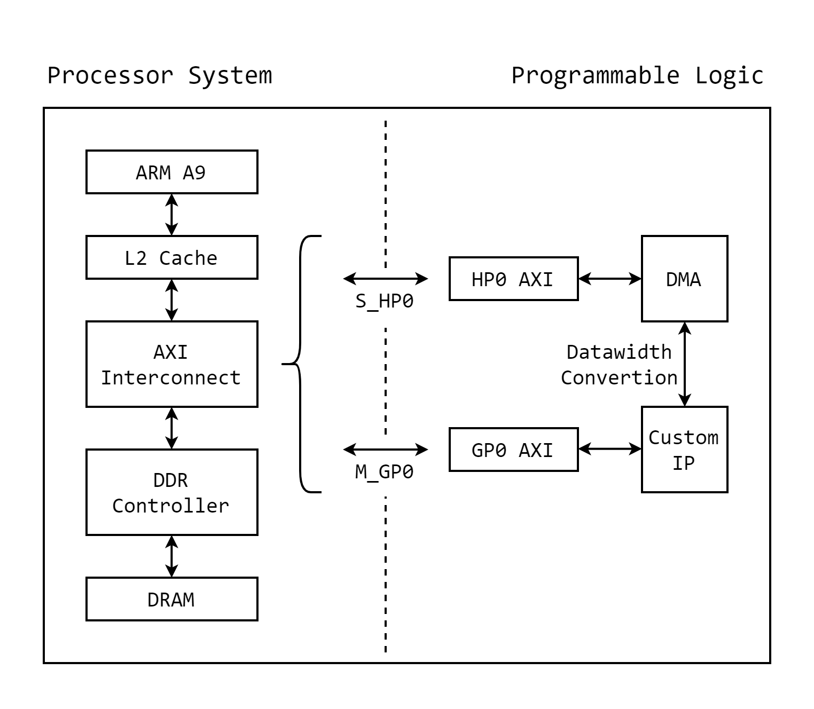

# Pynq Basics

PYNQ is an open-source project that aims to work on any computing platform and operating system. It run a web server through Jupyter Notebook infrastructure directly on the processor in heterogeneous devices with reconfigurable resource. Generally, the process of writing a Pynq program is as follows:

- **Initialize the PYNQ onboard system**: Start the Pynq onboard system by Overlay to load the corresponding bitstream and hardware descriptor files.
- **Obtaining hardware resources**: Based on the name of the IP module designed in the Programmable Logic, instantiate the corresponding programmable logic object in Python to interact with the hardware in the Programmable Logic.
- **Data transmission and processing**: According to specific needs, use Python to write the corresponding code to process, calculate and transmit the received data.
- **Clearing and releasing resources**: After a program is executed or hardware resources are no longer needed, release resources and ensure that the system shuts down properly.

The data transmission of the system is shown below.

